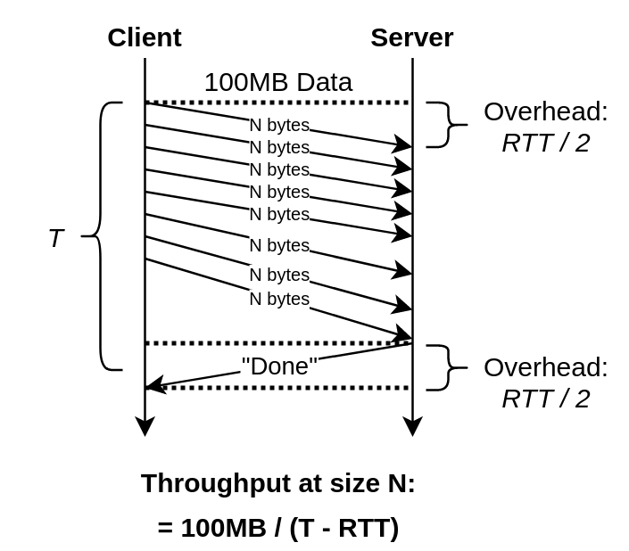

# RDMA Competition Exercise #1 - Throughput

**Key idea**: We measure the time of client transfering $N$ bytes of data to server, so the throughput between them is $N/(Time - Overhead)$. 




**A little more detail**: Every time we send $N$ bytes of data to server with different packet size, when server receives all of the data, it tells the client.  (Server replys "done" when it receives $N$ bytes of data.)
Notice: This will introduce unintended overhead, buf we fixed that: we'll measure the overhead first.

**Features: **

* **WARM-UP:** We do **warm-up rounds** to get OS ready first.
* **STABLE:** We keep measuring the **throughput until is stable** (varaiation < 1%).
* **OVERHEAD**: Since server sends an extra "done" message to client to indicate the ending of data transfer, it introduces overhead, which is exactly the half time of RTT. We takes it into consideration: we measures the RTT at first and **minus the overhad** when calculating throughput.


> Sizes/Byte: 1 2 4 8 16 32 64 128 256 512 1024 


## Build

```
make
```

## Run

Server side:

``` 
./server
```
Notice: The default port that server listen at is 6666, please check if the port is available.

Client side:

```
./client <server-ip-address>
```

## Example 

On 1Gbps eth
```
[user@login02 ex1-throughput]$ ./client 192.168.0.11
1   12.413690   Mbps
2   23.698684   Mbps
4   39.962892   Mbps
8   92.591493   Mbps
16  195.538049  Mbps
32  371.571475  Mbps
64  721.369048  Mbps
128 889.821203  Mbps
256 888.964672  Mbps
512 892.233194  Mbps
1024    890.618743  Mbps
```

On 100Gbps Infiband
```
$ ./client 192.168.130.12
1   12.822859   Mbps
2   23.580007   Mbps
4   42.350635   Mbps
8   68.995555   Mbps
16  121.223477  Mbps
32  131.284864  Mbps
64  789.112102  Mbps
128 1635.161976 Mbps
256 3074.070640 Mbps
512 5292.328407 Mbps
1024    8890.387590 Mbps
2048    13114.260098    Mbps
4096    16114.203625    Mbps
8192    15582.064932    Mbps
16384   17675.321126    Mbps
32768   17659.787204    Mbps
65536   18342.547263    Mbps
131072  18045.812701    Mbps
262144  17889.414146    Mbps
```
